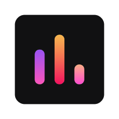

<div align="center">



  <h1>Logger Chart</h1>
    
#### Make charts from CSV-files

<br/>
<hr style="width:100%;height:2px;background:linear-gradient(0.25turn, rgba(245,165,36,0.8),rgba(243,18,96,1));"/>

<div align="left">

## Deployments 🎮

<br/>

<div style="display:flex;flex-direction: row;align-items: center;justify-content: space-around">
<div align="center">

[](https://logger-chart.vercel.app/)
</div>
</div>


<div align="left">

## Run Project 🚀

```text
yarn run dev
```

<hr style="width:100%;height:2px;background:linear-gradient(0.25turn, rgba(245,165,36,0.8),rgba(243,18,96,1));"/>


<div align="left">

## Features ⚡

-   Login to the App with Token
-   Build charts from CSV RAW data
-   Watch all charts
-   Adding Chars via drag & drop
-   Edit current chart data
-   Filtering charts values

## TODO 📋
-   [X] Add charts to the app
-   [X] Server-side CSV-file
-   [X] Read chart data from CSV-file
-   [X] Deployment on Vercel
-   [ ] Auth TOKEN mechanism
-   [ ] Add new charts by drag & drop
-   [ ] Modify chart data
-   [ ] Zooming charts

## Technical Info 📃

-   <a href="https://nextjs.org/">NextJS</a> as main engine ⚙️‍
-   <a href="https://recharts.org/">Recharts</a> 📊
-   <a href="https://www.typescriptlang.org/"> Typescript</a> for code writing 🖤
-   <a href="https://eslint.org/">Eslint</a> & <a href="https://prettier.io/">Prettier</a> for code styling 🖌️
-   <a href="https://nextui.org/">Next-UI</a> for styling (powered by <a href="https://stitches.dev/">Stitches</a>) 💅

</div>